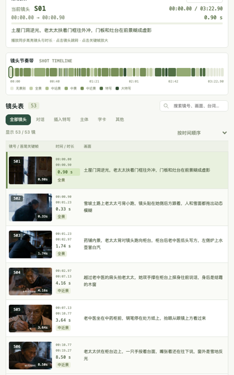

[](README.md)
[](README.en.md)
[](#ai-视频交流社群)
[](https://x.com/eternityspring)

# reelbench-skills

视频侧的 Claude Code / Codex skill。

| skill | 干什么 |
| --- | --- |
| [video-shots](skills/video-shots/) | **拉片**：把一条成片拆成逐镜头的分析表——时长、景别、类别、运镜、画面、节奏。切点与时长由 ffmpeg 量，模型只判断该判断的那几件事，15 道质量门逐条对账 |
| [video-sync](skills/video-sync/) | **合成带分镜信息的视频**：画面一边、分镜信息一边，镜头切了信息跟着切、镜头表自动滚动高亮。横版上下叠、竖版左右并，布局改一份 CSS 就行 |
| [video-scrub](skills/video-scrub/) | **清元数据**：把片子重建成只有画面和声音的干净文件，GPS、设备、账号 ID、遥测轨一概不搬。难的是 `ffprobe` 看不见的三层——SEI、AAC 的 DSE、compressorname。默认画面逐字节照搬，12 道门字节级验收 |

## AI 视频交流社群

我建了一个付费AI视频交流群，聊 AI 视频的工作流、工具和实操。

有兴趣的加我：微信 **`hao_dev`**，添加时备注 **`github`**。


## 安装

```bash
git clone https://github.com/eternityspring/reelbench-skills.git
cd reelbench-skills
./scripts/install.sh
```

软链到 `~/.claude/skills/` 和/或 `~/.codex/skills/`（哪个装了就装到哪），**`git pull` 之后立刻生效**。

```bash
./scripts/install.sh --claude      # 只装到 Claude Code
./scripts/install.sh --codex       # 只装到 codex
./scripts/install.sh video-shots   # 只装某一个 skill
./scripts/install.sh --uninstall   # 取消软链
```

依赖只有 `node` >= 18 和 `ffmpeg` / `ffprobe`（macOS：`brew install node ffmpeg`）。
**零 npm 依赖、零 API key**，用当前会话额度。

不想软链就直接拷：`cp -r skills/video-shots ~/.claude/skills/`——skill 自包含，拷走就能用。

## 示例

`demo-report/` 是拿 `demo-video.mp4`（202.9 秒的 AI 短片《啥是AI》）真跑出来的**完整产物**：
53 镜、平均镜长 3.83 秒、每分钟 15.7 切、15 道质量门全绿。
`demo-report-en/` 是同一套流程跑一段 287.4 秒的英文片段（`--lang en`，报告全英文）：
46 镜、平均镜长 6.25 秒、最长的一镜 46.92 秒——场景检测在那一段里一刀都没落，
因为它真的是一条不切的长镜头。

[](demo-report/shots-report.html)

报告是**单文件交互页**：内嵌播放器（播放时同步高亮镜头、点镜头跳转）、镜头节奏带、
可搜索可筛选可排序的镜头表（列表 / 卡片两种视图、首尾关键帧并排、点图开大图）、
统计分布、出场人物、质量检查。零外部依赖，离线双击能开。



```
demo-report/
├── shots-report.html   ← 克隆下来双击就能开
├── shots.json          ← 53 镜的拉片主数据
├── shots.md            ← Markdown 镜头表
├── track.json          ← 逐帧差分的运动曲线（机器证据）
└── frames/             ← 每镜首尾两张关键帧，共 106 张
```

`demo-scrub/` 是 **video-scrub** 的产出——四段文字，没有视频，因为它的成品和源片
**肉眼完全一样**，那正是设计目标。值得看的是那份对账，尤其
[`half.txt`](demo-scrub/half.txt)：用网上教的标准做法清完，`ffprobe` 一片干净，
而码流里 x264 写在 SEI 的编码参数串还有 4 处、AAC 的 DSE 里还有 8 处——
**任何 `ffprobe` 命令都看不见它们**。

**video-sync** 的产出在最后面——直接看视频。

## 成片长这样

287.4 秒的英文片段 + 46 镜分镜信息，1280×1296（原片 640×360，`--scale 2` 放大）。
镜头切了信息跟着切，列表往上滚、高亮跟着滑：

<video src="https://github.com/eternityspring/reelbench-skills/raw/main/demo-sync/demo-en-sync.mp4" controls muted playsinline width="760"></video>

播放器没出来就直接下载：[`demo-sync/demo-en-sync.mp4`](demo-sync/demo-en-sync.mp4)
