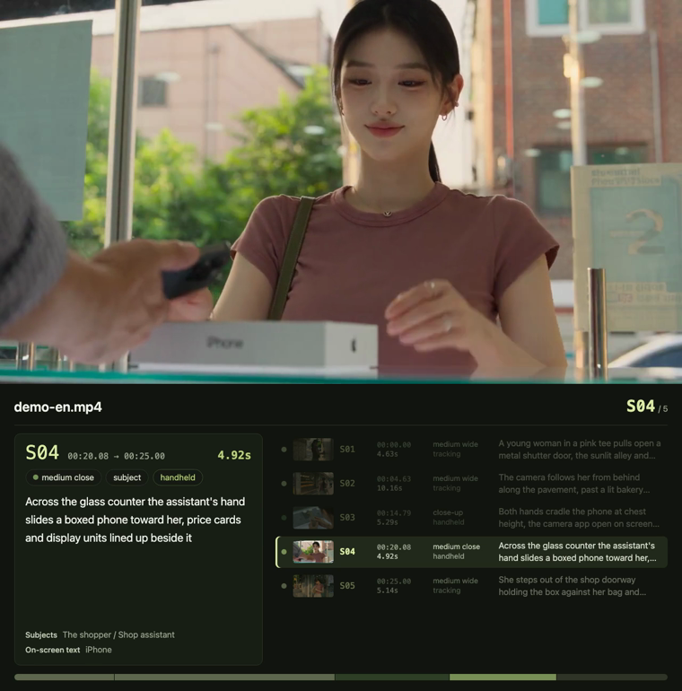
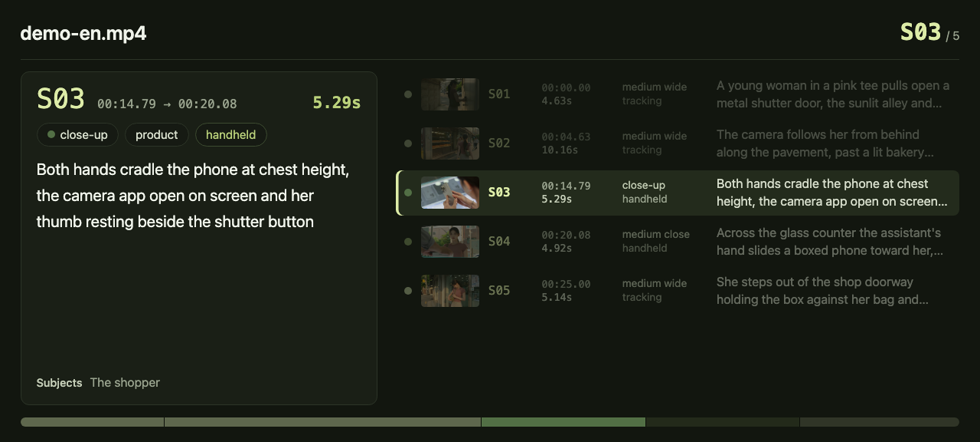
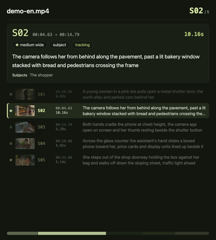

[](README.md)
[](README.en.md)

# video-sync

Turns a [video-shots](../video-shots/README.en.md) breakdown plus the source film into a
**video you can just watch**: the footage on one side, the current shot's data on the other.
**The panel changes when the film cuts** — the shot list scrolls itself and highlights the shot
that is playing.



## The layout follows the aspect ratio, nothing else

| Source | Layout | |
| --- | --- | --- |
| Landscape (w > h), square | **footage on top, data below** | `vstack` |
| Portrait (h > w) | **footage on the left, data on the right** | `hstack` |

The portrait case — the output is 1580×1080, roughly 3:2, not a vertical clip jammed into 16:9
with black bars:


Both directions **scale the footage as-is — never cropped, never stretched**; the panel fills the
rest of the canvas. Every dimension is rounded to an even number (h264 requires it) and the
panel's short side never drops below 260px (below that the text stops fitting). Details in
[`references/layout.md`](references/layout.md).

## One image per shot, not per frame

Only three things on the panel ever change: the current-shot card, which row is highlighted, and
how far the list has scrolled. **All three change only at cuts** — nothing moves inside a shot.
So 53 shots means 53 PNGs, laid out in a concat playlist by shot duration, and **the timing is
ffmpeg's timestamps** — not 53 `enable=between(t,…)` overlay expressions, where one wrong entry
is invisible.

The trade-off, stated up front: **the panel jumps at each cut, there is no smooth scrolling
animation.** Smooth would mean rendering every frame, which costs dozens of times more.

## The layout is yours to change

The panel is an HTML page and **everything about how it looks lives in
[`scripts/panel.css`](scripts/panel.css)** — edit that and the layout changes. No need to touch
the script or rethink the screenshot logic. Re-run `panels` and you have the new design.

| | |
| --- | --- |
|  |  |
| Landscape panel: current shot left, shot list right | Portrait panel: stacked |

`panels` also writes `panels/panel.html` — **open it in a browser to preview**, add `#S07` to the
URL to switch shots. Both layouts share one DOM and switch grid areas via `.landscape` /
`.portrait` on the body, so there is no second template to forget about. Conventions in
[`references/panel-style.md`](references/panel-style.md).

Font size scales with the panel (`base = clamp(12, min(width/38, height/26), 26)`), so the CSS
uses **rem everywhere** — this is video, and 13px that reads fine on a monitor is mush on a phone.

## Usage

```bash
# 0. Start from a video-shots run: shots.json (+ frames/ for thumbnails)

# 1. Geometry only, no video work (seconds — check the numbers before committing)
node scripts/video-sync.mjs plan shots.json --video clip.mp4

# 2. Render panels: one PNG per shot, plus a previewable panel.html
node scripts/video-sync.mjs panels shots.json --video clip.mp4 --frames frames --lang en

# 3. Compose (audio is carried over from the source)
node scripts/video-sync.mjs compose shots.json --video clip.mp4 -o out.mp4

# or in one go
node scripts/video-sync.mjs export shots.json --video clip.mp4 --frames frames -o out.mp4
```

Knobs: `--panel <ratio>` (landscape: panel height ÷ footage height, default 0.8; portrait: panel
width ÷ footage width, default 1.6), `--width` / `--height` (caps on the footage area), `--crf`
(quality), `--lang zh|en`.

Requirements: `node` >= 18 (standard library only) + `ffmpeg` / `ffprobe` + a headless browser
(Chrome / Chromium / Edge; `--chrome` takes a path). **No npm dependencies, no API keys.**

## "It didn't error" is not verification

Pull at least three frames and check **which shot the footage belongs to, whether the panel shows
that same shot number, and whether the highlighted row moved with it**:

```bash
for t in 5 30 60; do ffmpeg -v error -y -ss $t -i out.mp4 -frames:v 1 -q:v 3 /tmp/check-$t.jpg; done
```

A mismatch usually means shots.json and the film are not the same clip.

## Self-test

```bash
node scripts/selftest.mjs
# ✅ 73 assertions passed
```

No ffmpeg, no browser. It checks: geometry (landscape/square/portrait, even dimensions, caps,
knobs, erroring instead of guessing when dimensions are unreadable); the panel page's data
contract (vocabularies sent as names not enum keys, thumbnails only when the file exists,
`<script>` escaped); the concat playlist (the last image must be repeated or the final shot has no
duration); and the ffmpeg arguments (vstack/hstack, `setsar=1`, no audio mapping on a silent
source, the film must be input 0).

## Bundled example

`demo-sync/demo-en-sync.mp4` at the repository root: a 30-second English commercial with its
5-shot breakdown, 1280×1296 — the first screenshot above.

## Relationship to video-shots

```
video-shots  →  shots.json + frames/  →  video-sync  →  out.mp4
(breakdown: cutting and annotating)      (compositing: footage + data)
```

**The two skills are independent**: this one **carries its own copy** of the four vocabularies
rather than importing across directories — a skill has to survive being copied out on its own. The
price is that a new term added in `video-shots` has to be added here too, or it shows up as a raw
enum key.
